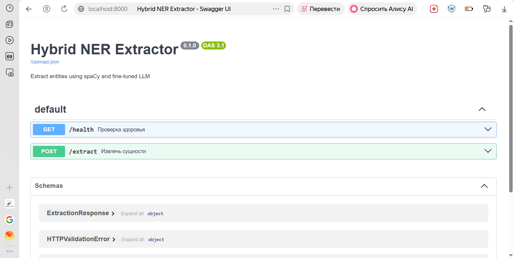
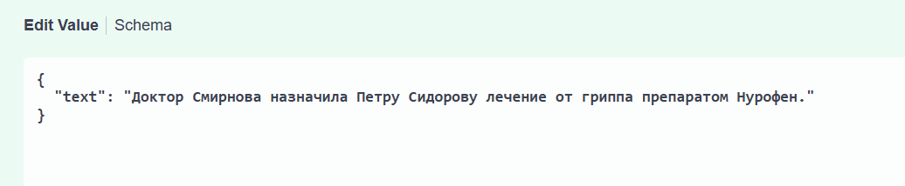
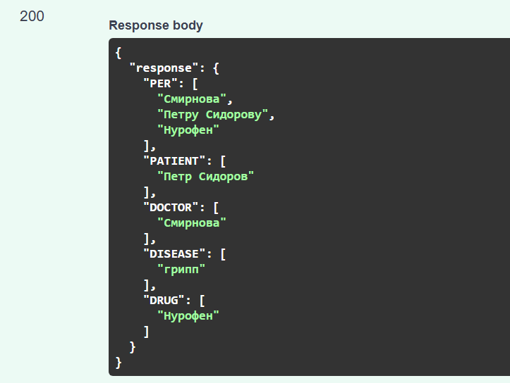
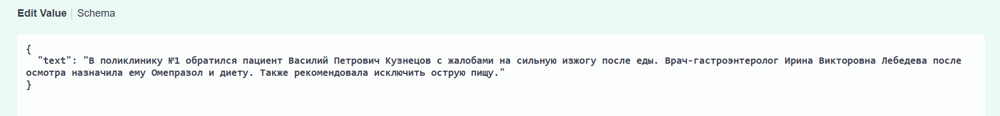
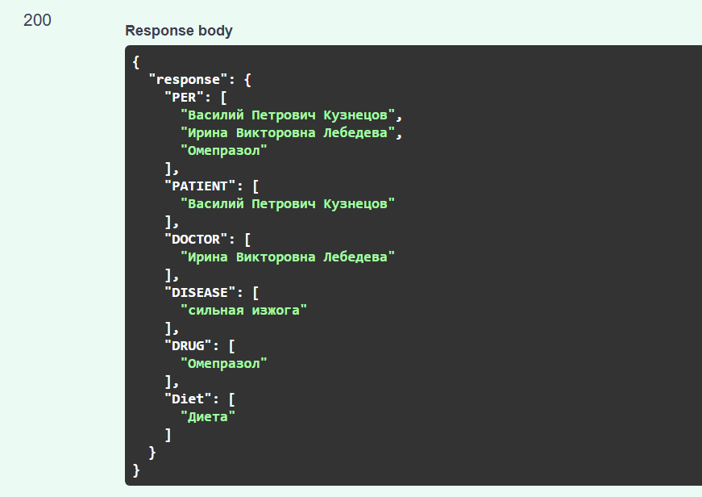
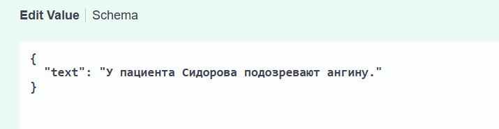
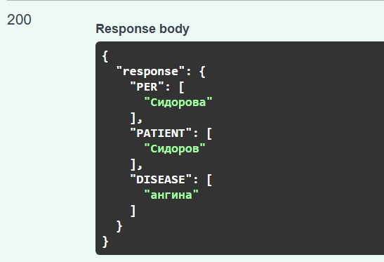
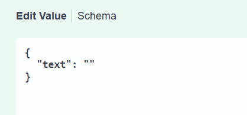
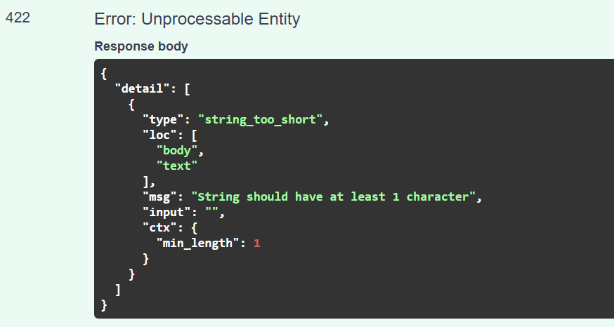

# Hybrid NER Extractor

Гибридная система извлечения именованных сущностей из медицинских текстов на русском языке. Объединяет классический NER (spaCy) и дообученную языковую модель (LLM) с использованием подхода QLoRA.

## Особенности

- **Классический NER** на основе spaCy (модель `ru_core_news_lg`) – извлекает общие сущности: имена людей (PER), организации (ORG), локации (LOC).
- **LLM-экстрактор** на базе `Qwen2.5-0.5B`, дообученный на синтетических данных с помощью QLoRA. Извлекает доменные сущности: `PATIENT`, `DOCTOR`, `DRUG`, `DISEASE`.
- **Гибридный подход** – объединяет результаты обоих методов, дополняя друг друга.
- **REST API** на FastAPI с эндпоинтами `/health` и `/extract`.
- **Автоматическая документация** Swagger UI и ReDoc.
- **Тесты** (pytest) для API и модулей.
- **Контейнеризация** (Docker) – опционально.

## Технологии

- Python 3.10
- PyTorch
- Hugging Face Transformers, PEFT (LoRA/QLoRA)
- spaCy (русская модель `ru_core_news_lg`)
- FastAPI, Uvicorn
- Pytest, HTTPX
- Docker

## Структура проекта
```
hybrid_ner_extractor/
├── data/processed/          # синтетические данные
├── models/llm_lora/         # LoRA-адаптер и токенизатор
├── src/
│   ├── classical_ner.py     # классический NER (spaCy)
│   ├── llm_extractor.py     # LLM-экстрактор (Qwen + LoRA)
│   ├── hybrid_extractor.py  # гибридный экстрактор
│   ├── api.py               # FastAPI приложение
│   └── prepare_dataset.py   # генерация синтетических данных (YandexGPT)
├── tests/
│   ├── conftest.py
│   ├── test_api.py
│   └── test_hybrid.py
├── Dockerfile
├── docker-compose.yml
├── requirements.txt
└── README.md
```
## Установка и запуск (локально)

### 1. Клонируйте репозиторий

```bash
git clone https://github.com/yuliagavrilova1111/hybrid-ner-extractor.git
cd hybrid-ner-extractor
```

### 2. Создайте и активируйте виртуальное окружение
```bash
python -m venv venv
# Windows:
venv\Scripts\activate
# Linux / macOS:
source venv/bin/activate
```

### 3. Установите зависимости
```bash
pip install -r requirements.txt
```

### 4. Скачайте модель spaCy
```bash
python -m spacy download ru_core_news_lg
```

### 5. Загрузите обученный LoRA-адаптер
Адаптер (папка models/llm_lora/) доступен для скачивания по ссылке:
[Скачать с Google Drive](https://drive.google.com/drive/folders/1xVfC7Ai0-VANa0bI78J1kLy9NUw1x0sN?usp=drive_link)

После скачивания распакуйте архив в папку models/llm_lora так, чтобы внутри были файлы:
adapter_config.json
adapter_model.safetensors
tokenizer.json, tokenizer_config.json и другие.

### 6. Запустите сервер
```bash
uvicorn src.api:app --reload
```
Сервер будет доступен по адресу: http://localhost:8000

### 7. Откройте интерактивную документацию
Swagger UI: http://localhost:8000/docs

## Примеры запросов и ответов

Главная страница


Пример 1. Полный набор сущностей
Запрос:

Ответ:


Пример 2. Длинный текст с дополнительными деталями
Запрос:

Ответ:


Пример 3. Текст без врача и лекарства (проверка отсутствия сущностей)
Запрос:

Ответ:


Пример 4. Пустой текст (проверка валидации)
Запрос:

Ответ:


## Запуск через Docker (опционально)
```bash
docker-compose build
docker-compose up -d
```

## Оценка качества модели
Дообучение выполнено с использованием QLoRA (4‑битная квантизация + LoRA) на 600 синтетических примерах (YandexGPT) и 50 валидационных.  
Итоговый loss на валидации: **~0.16**.  
Модель успешно извлекает 4 доменных типа сущностей (`PATIENT`, `DOCTOR`, `DRUG`, `DISEASE`), демонстрируя способность обобщения на реальных медицинских текстах.